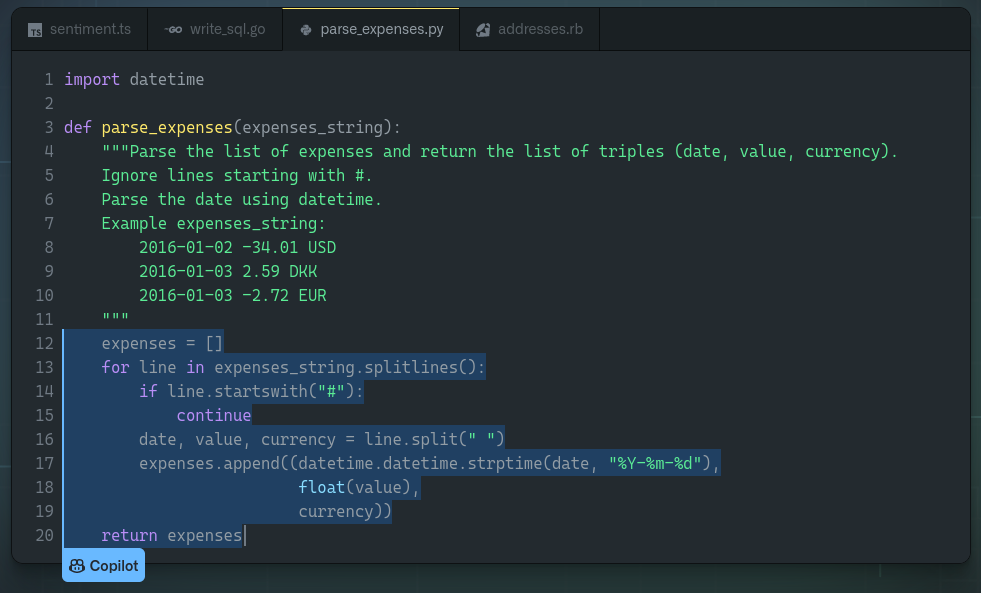

# Natural Language Processing

## Fernando Rabanal Presa

**Máster Big Data Science (Universidad de Valladolid)**

---
<!-- paginate: true -->
<!-- footer: 'NLP - Máster Big Data Science (UVA)' -->

## Disclaimer

* All materials provided here reflect my own views and not those of my employer.


* Please, do not take my opinions too seriously as I tend to be wrong more times than expected (on average) every single day.

---

### [https://github.com/frabanalpresa/mbds](https://github.com/frabanalpresa/mbds)

---
## Who am I?


* Linkedin: [fernandorabanal](https://www.linkedin.com/in/fernandorabanal/)
* Email: [frabanalpresa@gmail.com](mailto:frabanalpresa@gmail.com)

---

## Who am I?


* Telecommunications Engineer (UVa)

* MSc. Multimedia & Communications (UC3M / URJC)

* *Kaggle* master level
  - NLP Competition winner

* Data Scientist:
  - NeoMetrics / Accenture
  - Touchvie / Dive
  - Vodafone Group

---

## But it is more interesting to see what can you do

* Complete a MSc program in Data Science (you're on the right track!)

* Complement your knowledge with some MOOC programs

* Practice with different problems

* Enter Data Science competitions

* Provide value to your company

---


---

## What is Natural Language Processing?

---

> Are there imaginable digital computers which would do well in the imitation game?

Alan Turing, "Computing Machinery and Intelligence", 1950

---

> The ability of a machine to analyze, understand, and generate human speech. Its goal is to make interactions between computers and humans feel exactly like interactions between humans and humans.

[NeoSpeech, 2013](https://blog.neospeech.com/what-is-natural-language-processing/) definition of NLP

---

## NLP Applications

---

### Chatbots


Ordering with Tacobot in **Slack**. Original blog post by  [chatbotsmagazine](https://chatbotsmagazine.com/11-examples-of-conversational-commerce-57bb8783d332)

---

### Spam filtering
<br>


- Analyzes header
- Explores content
- Checks for spamming rules

---

### Text classification


[Towards Data Science](https://towardsdatascience.com/machine-learning-nlp-text-classification-using-scikit-learn-python-and-nltk-c52b92a7c73a) article on Text classification with scikit-learn and NLTK

---

### Text tagging (clustering)
<br>


**Flickr** [tags](https://www.flickr.com/photos/tags) page.

---

### News summarization


[Agolo](https://www.agolo.com) is a commercial news summarizer software.

---

### Algorithmic trading


---
<!-- _color: blue -->
### <!-- fit--> How can I help you?


---

## NLP usual workflow

---

### Text preprocessing
<br>

```
# Text cleaning
# Lemmatization / stemming
# Stopwords
# Tokenization
```

---

### Text modeling
<br>

```
# Bag of words
# TF-IDF
# Word embeddings
```
---

### Extract insights
<br>

```
# Sentiment analysis
# Clustering
# Supervised problems
# Generative models
```

---

### Complete NLP workflow
<br>

```
# Text cleaning
# Lemmatization / stemming
# Stopwords
# Tokenization

# Bag of words
# TF-IDF
# Word embeddings

# Sentiment analysis
# Clustering
# Supervised problems
# Generative models
```

---

## Text preprocessing

---

### Why?
<br>

* **Words**: Lorem ipsum dolor sit amet...
* **Redundancy**: As already said before...
* **Variations**: dog, dogs, puppies...

---

## <!-- fit -->Math does not allow words!

---

### Text cleaning
<br>

```
import re
from string

# Use BeautifulSoup instead!
text = re.sub(r'(<.*?>)', '', text)
text = re.sub(r'https?:\/\/.*[\r\n]*','', text)
text = text.translate(str.maketrans('', '', string.punctuation))
```

- Strip markup tags

- Remove URLs

- Remove punctuation signs

---

### Text cleaning (II)
<br>

```
from nltk.corpus import stopwords

text = text.lower()
text = [word for word in text.split() if word not in ['figure', 'table']]
text = [word for word in text.split() if word not in stopwords.words('english')]
```

- Normalize to lowercase characters

- Remove non-informative words, expressions...

- Remove non-alphanumeric characters

---

### Lemmatization
<br>

> Lemmatization is the process of grouping together the inflected forms of a word so they can be analysed
as a single item, identified by the word's **lemma**, or dictionary form.

[Lemmatization](https://en.wikipedia.org/wiki/Lemmatisation) Wikipedia page

---

### Lemmatization: examples
<br>

```
lemmatize('better') = 'good'
lemmatize('walking') = 'walk'
lemmatize('meeting') = ['meet', 'meeting']
```

- Lemmatization assumes language knowledge.

- And more than one lemma can result from process.

---

### Stemming
<br>

> Stemming is the process of reducing inflected (or sometimes derived) words to their word stem,
base or root form—generally a written word form.

[Stemming](https://en.wikipedia.org/wiki/Stemming) Wikipedia page

---

### Stemming: examples
<br>

```
stem('better') = 'better'
stem('walking') = 'walk'
stem('meeting') = 'meet'
```

- No linguistics assumed.

- Just morphological root is returned.

---

### Stopwords removal
<br>


tidytext: Word Clouds and Sentiment Analysis in R, [Michael Grogan](http://www.michaeljgrogan.com/tidytext-word-clouds-sentiment-r/)

---

### Stopwords list (ES)
<br>

|         |          |       |      |      |
| ------- |:--------:|:-----:|:----:|:----:|
| un      | aquél    | ante  | y    | muy  |
| una     | aquéllos | bajo  | o    | poco |
| unas    | aquélla  | de    | mas  | con  |
| unos    | aquéllas | desde | sino | sin  |
|         |          |       |      |      |

---

### Stopwords list (domain-specific, EN)
<br>

|         |              |             |
| ------- |:------------:|:-----------:|
| et al   | section      | conclusions |
| figure  | work         | references  |
| table   | introduction | abstract    |
|         |              |             |

<br>

- Normalized stopwords, **lowercase**

---

### Tokenization
<br>


Tokenization example

---

> Tokenization is the process of demarcating and possibly classifying sections of a string of input characters.

[Tokenization](https://en.wikipedia.org/wiki/Lexical_analysis#Tokenization) Wikipedia page

---

### Different ways of tokenizing
<br>

```
'lorem ipsum dolor sit amet'.split()
# ['lorem', 'ipsum', 'dolor', 'sit', 'amet']

['2way'] != ['2', 'way']

['state-of-the-art'] != ['state', 'of', 'the', 'art']
```
- Split sentences by spaces

- Account for words with numbers!

- Hyphens in words

---

### How should I tokenize?
<br>

Tokenization is usually:
* A manual process
* Data driven
* Task-specific
* Language-specific

---

## Text modeling

---


---

### Bag of Words (BoW)
<br>

Intends to obtain a **Vector Space** representation of a document, originally in text domain.

---

- Madrid looks sunnier than usual this spring (1)
- Real Madrid plays against Atlético Madrid tonight (2)
<br>

|      | Madrid | looks | plays | sunnier | tonight | spring |
| ---- |:------:|:-----:|:-----:|:-------:|:-------:|:------:|
| (1)  | 1      | 1     | 0     | 1       | 0       | 1      |
| (2)  | 2      | 0     | 1     | 0       | 1       | 0      |
|      |        |       |       |         |         |        |

---

### N-gram representation
<br>

> *n-gram* is a contiguous sequence of n items from a given sample of text or speech. The items can be phonemes,
syllables, letters, words or base pairs according to the application.

[n-gram](https://en.wikipedia.org/wiki/N-gram) Wikipedia page

---

Real Madrid plays against Atlético Madrid tonight.
<br>

| Unigram (size 1) | Bigram (size 2) |
|:----------------:|:---------------:|
| Madrid           | Real Madrid     |
| Madrid           | Atlético Madrid |
| plays            | plays against   |

---

### TF-IDF: Term Frequency (TF)
<br>

> Different measures of raw frequency.
<br>

$$tf(t,d) = f(t,d)$$
$$tf(t,d) = 1 + log(f(t,d))~,~ log(0):=0$$
$$tf(t,d) = f(t,d)~/~max(\lbrace f(w,d) : w \in D \rbrace)$$

---

### TF-IDF: Inverse Document Frequency (IDF)
<br>

> Commonality of the term in the whole collection of documents.
<br>

$$idf(t,D) = \log \dfrac{|D|}{|\lbrace d \in D : t \in d \rbrace|}$$

---

## Word embeddings

---


Visualization of 3M words from GoogleNews dataset as embedded by  [UMAP](https://arxiv.org/pdf/1802.03426.pdf)

---


---

Representation of different word embeddings for MNIST ([Hashimoto et al., 2015](https://arxiv.org/pdf/1509.05808.pdf))

- [GloVe](https://nlp.stanford.edu/projects/glove/)
- [FastText](https://fasttext.cc/)
- [Word2Vec / Doc2Vec](https://arxiv.org/pdf/1301.3781.pdf?)

---

## Character n-gram embeddings

Why?
<br>

* Fit out-of-vocabulary words
* Adapt mispelled words
* Handle infrequent words
* Lower model complexity (more speed)

---

Some models for character embedding:

- [CNN (Microsoft)](http://www.iro.umontreal.ca/~lisa/pointeurs/ir0895-he-2.pdf)
- [CNN (IBM)](http://proceedings.mlr.press/v32/santos14.pdf)
- [CNN (NYU)](https://arxiv.org/pdf/1509.01626.pdf)
- [JMT](https://arxiv.org/pdf/1611.01587.pdf)

---

## Contextualized word embeddings


Results comparing GloVe and Cove, from [CoVe](http://papers.nips.cc/paper/7209-learned-in-translation-contextualized-word-vectors.pdf) paper

---

- [CoVe](http://papers.nips.cc/paper/7209-learned-in-translation-contextualized-word-vectors.pdf)
- [ELMo](https://arxiv.org/pdf/1802.05365.pdf)

---

## Extract insights


[Dashboard](https://plot.ly/python/dashboard/) example in [Plotly](https://plot.ly)

---

## Sentiment analysis


Sample dashboard from satisfaction terminals company. [Link](https://www.happy-or-not.com/es/smiley-terminal-2/)

---


Wordcloud for negative sentiment reviews made by [budhiraja](https://www.kaggle.com/budhiraja/initial-analysis-and-word-clouds) in [Kaggle](https://www.kaggle.com)
<br>

- Count pos/neg words
- Classify docs
- Document similarity

---

## Clustering

---


Visualization of 3M words from GoogleNews dataset as embedded by  [UMAP](https://arxiv.org/pdf/1802.03426.pdf)

---


---

[Comparing different clustering algorithms on toy datasets](http://scikit-learn.org/stable/auto_examples/cluster/plot_cluster_comparison.html)

---

### LSI/LSA


Sample topics extracted from Amazon Fine Food Reviews dataset.

---

## Supervised problems

---


[Towards Data Science](https://towardsdatascience.com/machine-learning-nlp-text-classification-using-scikit-learn-python-and-nltk-c52b92a7c73a) article on Text classification with scikit-learn and NLTK

---

### K-Nearest Neighbors
<br>


5-NN applied over a given dataset ([Wikipedia](https://en.wikipedia.org/wiki/K-nearest_neighbors_algorithm))

---

### Linear/logistic regression
<br>


Logistic function, base equation for [logistic regression](https://en.wikipedia.org/wiki/Logistic_regression)

---

Linear regression:

$$ y = w_{1} x_{1} + w_{2} x_{2} + \cdots + w_{N} x_{N} + b$$

<br>

Logistic regression:

$$ ln \left ( \dfrac{p_{i}}{1-p_{i}}\right) = w_{1} w_{1} + w_{2} x_{2} + \cdots + w_{N} x_{N} + b $$

---

### Neural Networks


The base of every neural network is the [perceptron](https://en.wikipedia.org/wiki/Perceptron)

---

### Support Vector Machines


Spatial transformation provided by kernels in [SVMs](https://en.wikipedia.org/wiki/Support_vector_machine)

---


---

## Generative modeling
<br>

**Deep Dream** example by [deepdreamgenerator](https://deepdreamgenerator.com)

---

### Generative models


**Recurrent Net** by [AnalyticsVidhya](https://www.analyticsvidhya.com/blog/2017/12/introduction-to-recurrent-neural-networks/)

---

- [LSTM](https://deeplearning4j.org/lstm.html)
- [GANs](https://deeplearning4j.org/generative-adversarial-network)

---

## POS tagging

---


Example of POS tagging from ([Panichella](https://www.researchgate.net/publication/317932958_Analyzing_APIs_Documentation_and_Code_to_Detect_Directive_Defects), 2017)

---

## Named-Entity Recognition (NER)

---


Example from [NER: Applications and Use Cases](https://towardsdatascience.com/named-entity-recognition-applications-and-use-cases-acdbf57d595e)

---

## Semantic Role Labeling

---


Example from class notes on [SRL](https://www.slideshare.net/marinasantini1/semantic-role-labeling)

---

## Software modules

---

### tm (R)


[tm](https://cran.r-project.org/web/packages/tm/tm.pdf) documentation first page.

---

**Features:**

| Pros                    | Cons              |
|:-----------------------:|:-----------------:|
| Classic solution        | Low-level package |
| Stable                  |                   |
| Extensible with plugins |                   |

---

### tidytext (R)


[tidytext](https://www.tidytextmining.com/) book cover

---

**Features:**

| Pros                             | Cons                    |
|:--------------------------------:|:-----------------------:|
| Great documentation and textbook | Small support community |
| High-level algorithms            |                         |
| Pipelines supported              |                         |

---

### quanteda (R)
<br>


<br>

[quanteda](https://tutorials.quanteda.io/) logo

---

**Features:**

| Pros                     | Cons                         |
|:------------------------:|:----------------------------:|
| Good documentation       | Still in-memory solution (R) |
| Wide range of activities |                              |
| Wide range of languages  |                              |

---

### NLTK (Python)
<br>


[NLTK](https://www.nltk.org/) example on sentence parsing.

---

**Features:**

| Pros                       | Cons                    |
|:--------------------------:|:-----------------------:|
| Myriad of resources        | Lacks newest algorithms |
| Complete classic NLP       |                         |
| Standard solution for NLP  |                         |
| Huge community             |                         |

---

### gensim (Python)
<br>


<br>

[RARE Technologies](http://rare-technologies.com/) logo, creators of [Gensim](https://radimrehurek.com/gensim/)

---

**Features:**

| Pros                             | Cons                       |
|:--------------------------------:|:--------------------------:|
| High-level algorithms            | Learning curve             |
| Some cutting-edge advances       | Difficult to grasp details |
| In-disk capabilities             |                            |
| Great documentation and examples |                            |
| Distributed computing            |                            |
| R counterpart: **text2vec**      |                            |

---

### SpaCy (Python)
<br>


<br>

[SpaCy](https://spacy.io) logo

---

**Features:**

| Pros                                   | Cons                          |
|:--------------------------------------:|:-----------------------------:|
| Focus on production-ready models       | Need for Tensorflow, Keras... |
| Not so extensive open-source community | Difficult to grasp details    |
| R package also available (**spacyr**)  |                               |

---

### Other libraries (Python)

- [Polyglot](http://polyglot.readthedocs.org/)
- [TextBlob](https://textblob.readthedocs.io/en/dev/)

---

### Cutting-edge open source releases

| Name | Company | Year | Architecture |
|:-----|:--------|:-----|:---------|
| [PyText](https://github.com/facebookresearch/pytext) | Facebook | 2018| Deep Learning over PyTorch |
| [BERT](https://github.com/brightmart/bert_language_understanding) | Google | 2018 | Deep Bidirectional Transformers over Tensorflow |
| [NLP Architect](https://github.com/NervanaSystems/nlp-architect) | Nervana (Intel) | 2018 |Framework with latest developments |
| [Flair](https://github.com/zalandoresearch/flair) | Zalando | 2018 |Bidirectional LSTM-CRF |
| [XLNet](https://github.com/zihangdai/xlnet/) | Google | 2019 |Autorregresive (AR) Transformer (340M parameters) |

---

### Cutting-edge open source releases

| Name | Company | Year | Architecture |
|:-----|:--------|:-----|:---------|
| [GPT-2](https://openai.com/blog/gpt-2-1-5b-release/) | OpenAI | 2019 | AR Transformer (1.5B parameters) |
| [T5](https://arxiv.org/abs/1910.10683) | Google | 2019 | AR Transformer (11B parameters) |
| [GPT-3](https://arxiv.org/abs/2005.14165) | OpenAI | 2020 |AR Transformer (175B parameters) |
| [Jurassic-1](https://uploads-ssl.webflow.com/60fd4503684b466578c0d307/61138924626a6981ee09caf6_jurassic_tech_paper.pdf) | AI21 | 2021 | AR Transformer (178B parameters) |
| [Megatron-Turing NLG](https://www.microsoft.com/en-us/research/blog/using-deepspeed-and-megatron-to-train-megatron-turing-nlg-530b-the-worlds-largest-and-most-powerful-generative-language-model/) | Microsoft$^1$ | 2021 | AR Transformer (178B parameters) |
| [Gopher](https://deepmind.com/blog/article/language-modelling-at-scale) | DeepMind | 2021 |AR Transformer (280B parameters) |

$^1$ It was the result of a collaboration between Microsoft and NVIDIA.

---


How BERT changed Google, by its [Vice President](https://www.blog.google/products/search/search-language-understanding-bert/).

---


Trend of sizes of state-of-the-art NLP models over time, from [Megatron-Turing NLG](https://www.microsoft.com/en-us/research/blog/using-deepspeed-and-megatron-to-train-megatron-turing-nlg-530b-the-worlds-largest-and-most-powerful-generative-language-model/) blog post.

---

## Commercial software


|  |  |  |  |
|:-|:-|:-|:-|
| IBM Watson | Google Cloud Translation | NVivo | IBM SPSS Text Analytics |
| SAS High Performance Text Mining | Microsoft Language Understanding Intelligent Service | OdinText | Amazon Comprehend |
|  |  |  |  |

---

## Where are we now?

---

**This chair did not exist**
<br>

The image was generated by [DALL-E](https://openai.com/blog/dall-e/) from the prompt:

*"an armchair in the shape of an avocado. An armchair imitating an avocado"*


---

**AI-based code completion** 



[Github Copilot](https://copilot.github.com/) demo, completing your code in different languages. So you don't have to.

---

**AI can generate the next blockbuster** 


Netflix AI-generated horror movie, available in [Youtube](https://www.youtube.com/watch?v=WZzbxNoMjGM)

---

## What is yet to come?

---

* Improve support for different languages.
* Algorithmic fairness.
* Increase models explainability.
* Improve human-level details (sarcasm, context, mispelling...)
* Leverage different models for NLP ([local models](https://arxiv.org/pdf/1802.05319.pdf) vs deep learning)
* [VentureBeat](https://venturebeat.com/2021/12/29/what-will-applied-ai-look-like-in-2022/) article on AI trends for 2022.

* ... and whatever you can think of!

---

## Online resources

---

* [RDataMining](http://www.rdatamining.com/docs)
* [Datacamp](https://www.datacamp.com/community/blog/text-mining-in-r-and-python-tips) tips for Text Mining projects in R/Python
* [gensim](http://radimrehurek.com/gensim/wiki.html) documentation page (with tutorials).
* [tidytext](http://tidytextmining.com/) R package textbook.
* [NLTK](http://www.nltk.org/book/) free textbook for NLP with Python.
* [Information Retrieval](https://nlp.stanford.edu/IR-book/) textbook (Free)
* [Foundations of Statistical Natural Language Processing](https://nlp.stanford.edu/fsnlp/promo/) textbook (Not free)
* [Modern Deep Learning techniques applied to NLP](https://nlpoverview.com/)
* [Repository for state-of-art NLP solutions](https://github.com/sebastianruder/NLP-progress)

---

## <!--fit--> Any questions?


