@title[Main slide]

## Natural Language Processing
<span style="font-size:0.6em; color:gray">Máster Big Data Science (UVa)</span> |
<span style="font-size:0.6em; color:gray">Fernando Rabanal Presa</span>

---
#### Disclaimer

<br><hr>
All materials provided here reflect my own views and not those of my employer.
<hr>
Please, do not take my opinions too seriously as I tend to be wrong more times than expected (on average) every single day.

---

[https://gitpitch.com/frabanalpresa/mbds/master](https://gitpitch.com/frabanalpresa/mbds/master)

---
### Who am I?


<span style="color:gray; font-size:0.6em">Linkedin: [fernandorabanal](https://www.linkedin.com/in/fernandorabanal/)</span> |
<span style="color:gray; font-size:0.6em">Email: [frabanalpresa@gmail.com](mailto:frabanalpresa@gmail.com)</span>
<br>

@fa[arrow-down]

+++

<table style="color:gray; font-size:0.8em">
  <tr>
    <td>Telecommunications Engineer</td>
    <td>UVa</td>
  </tr>
  <tr class="fragment">
    <td>MSc. Multimedia & Communications (Signal Theory)</td>
    <td>UC3M / URJC</td>
  </tr>
  <tr class="fragment">
    <td>*Kaggle* master level</td>
    <td>(NLP Competition winner)</td>
  </tr>
  <tr class="fragment">
    <td>Data Scientist</td>
    <td>NeoMetrics / Accenture</td>
  </tr>
  <tr class="fragment">
    <td>Data Scientist</td>
    <td>Touchvie / Dive</td>
  </tr>
  <tr class="fragment">
    <td>Data Scientist</td>
    <td>Vodafone Group</td>
  </tr>
</table>

<br>

@fa[arrow-down]

+++

#### But it is more interesting to see what can you do

<br>

- Complete a MSc program in Data Science (you're on the right track!)
- Complement your knowledge with some MOOC programs |
- Practice with different problems |
- Enter Data Science competitions |
- Provide value to your company |

---

### What is Natural Language Processing?

<br>

> Are there imaginable digital computers which would do well in the imitation game?

<div style="text-align: right"><span style="color:gray; font-size:0.5em">Alan Turing, "Computing Machinery and Intelligence", 1950</span></div>

@fa[arrow-down]

+++

> The ability of a machine to analyze, understand, and generate human speech. Its goal is to make interactions between computers and humans feel exactly like interactions between humans and humans.

<div style="text-align: right"><span style="color:gray; font-size:0.5em">[NeoSpeech, 2013](https://blog.neospeech.com/what-is-natural-language-processing/) definition of NLP</span></div>

---

### Applications

<br><br>

@fa[arrow-down]

+++

**Chatbots**


<span style="color:gray; font-size:0.5em">Ordering with Tacobot in <b>Slack</b>. Original blog post by  [chatbotsmagazine](https://chatbotsmagazine.com/11-examples-of-conversational-commerce-57bb8783d332)</span>

@fa[arrow-down]

+++

**Spam filtering**


<span style="font-size:0.5em; color:gray">Analyzes header</span> |
<span style="font-size:0.5em; color:gray">Explores content</span> |
<span style="font-size:0.5em; color:gray">Checks for spamming rules</span>

@fa[arrow-down]

+++

**Text classification**


<span style="color:gray; font-size:0.5em">[Towards Data Science](https://towardsdatascience.com/machine-learning-nlp-text-classification-using-scikit-learn-python-and-nltk-c52b92a7c73a) article on Text classification with scikit-learn and NLTK</span>


@fa[arrow-down]

+++

**Text tagging (clustering)**

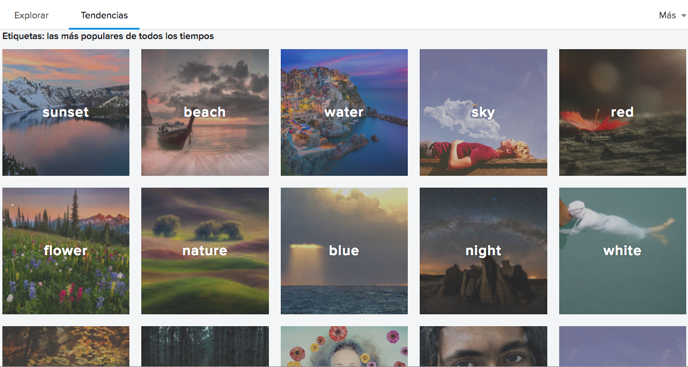

<span style="color:gray; font-size:0.5em"><b>Flickr</b> [tags](https://www.flickr.com/photos/tags) page.</span>

@fa[arrow-down]

+++

**News summarization**


<span style="color:gray; font-size:0.5em">[Agolo](https://www.agolo.com) is a commercial news summarizer software.</span>


@fa[arrow-down]

+++

**Algorithmic trading**

<canvas data-chart="line">
<!--
{
 "data": {
  "labels": ["Sep 22","Sep 23","Sep 24","Sep 25","Sep 26","Sep 27","Sep 28", "Sep 29", "Sep 30"],
  "datasets": [
   {
    "data":[0.057156, 0.058499, 0.056775, 0.06, 0.060428, 0.074999, 0.104, 0.074786, 0.069976],
    "label":"ZEC/BTE",
    "backgroundColor":"rgba(20,220,220,.8)"
   }
  ]
 },
 "options": { "responsive": "true" }
}
-->
</canvas>

<span style="color:gray; font-size:0.5em">Cryptocurrencies ZEC/BTE exchange rate</span>

---

**NLP usual workflow**

```python
# Text cleaning
# Lemmatization / stemming
# Stopwords
# Tokenization

# Bag of words / TF-IDF /
# Word embeddings

# Sentiment analysis
# Clustering
# Supervised problems
# Generative models
```
@[1-4](Text preprocessing)
@[6-7](Text modeling)
@[9-12](Extract insights)

---

### Text preprocessing

<br><br>

@fa[arrow-down]

+++

**Why?**

<br>

<table>
  <tr>
    <td>Words</td>
    <td>Lorem ipsum dolor sit amet...</td>
  </tr>
  <tr class="fragment">
    <td>Redundancy</td>
    <td>As already said before...</td>
  </tr>
  <tr class="fragment">
    <td>Variations</td>
    <td>dog, dogs, puppies...</td>
  </tr>
</table>

<br>
<span style="color:gray; font-size:0.8em">Math does not allow words!</span>

---

**Text cleaning**

```python
import re
from string

# Use BeautifulSoup instead!
text = re.sub(r'(<.*?>)', '', text)
text = re.sub(r'https?:\/\/.*[\r\n]*','', text)
text = \
  text.translate(str.maketrans('', '',
                 string.punctuation))
```

@[1,4-6](Strip markup tags)
@[1,6](Remove URLs)
@[1-2,7-9](Remove punctuation signs)

@fa[arrow-down]

+++

**Text cleaning (II)**

```python
from nltk.corpus import stopwords

text = text.lower()
text = [word for word in text.split()
        if word not in ['et al', 'figure', 'table']]
text = [word for word in text.split()
        if word not in stopwords.words('english')]
```

@[3](Normalize to lowercase characters)
@[4-5](Remove non-informative words, expressions...)
@[1, 6-7](Remove non-alphanumeric characters)

---

**Lemmatization**

> Lemmatization is the process of grouping together the inflected forms of a word so they can be analysed
as a single item, identified by the word's **lemma**, or dictionary form.

<div style="text-align: right"><span style="color:gray; font-size:0.5em">[Lemmatization](https://en.wikipedia.org/wiki/Lemmatisation) Wikipedia page</span></div>

@fa[arrow-down]

+++

**Lemmatization examples**

```python
lemmatize('better') = 'good'
lemmatize('walking') = 'walk'
lemmatize('meeting') = ['meet', 'meeting']
```

@[1,2](Lemmatization assumes language knowledge.)
@[3](And more than one lemma can result from process.)

---

**Stemming**

> Stemming is the process of reducing inflected (or sometimes derived) words to their word stem,
base or root form—generally a written word form.

<div style="text-align: right"><span style="color:gray; font-size:0.5em">[Stemming](https://en.wikipedia.org/wiki/Stemming) Wikipedia page</span></div>

@fa[arrow-down]

+++

**Stemming examples**

```python
stem('better') = 'better'
stem('walking') = 'walk'
stem('meeting') = 'meet'
```

@[1,2](No linguistics assumed.)
@[3](Just morphological root is returned.)

---

**Stopwords removal**


<span style="color:gray; font-size:0.5em">tidytext: Word Clouds and Sentiment Analysis in R, [Michael Grogan](http://www.michaeljgrogan.com/tidytext-word-clouds-sentiment-r/)</span>

@fa[arrow-down]

+++

**Stopword list (ES)**
<br>

<table>
  <tr>
    <td>un</td>
    <td>una</td>
    <td>unas</td>
    <td>unos</td>
  </tr>
  <tr class="fragment">
    <td>aquél</td>
    <td>aquéllos</td>
    <td>aquélla</td>
    <td>aquéllas</td>
  </tr>
  <tr class="fragment">
    <td>ante</td>
    <td>bajo</td>
    <td>de</td>
    <td>desde</td>
  </tr>
  <tr class="fragment">
    <td>y</td>
    <td>o</td>
    <td>mas</td>
    <td>sino</td>
  </tr>
  <tr class="fragment">
    <td>muy</td>
    <td>poco</td>
    <td>con</td>
    <td>sin</td>
  </tr>
</table>


@fa[arrow-down]

+++

**Stopword list (domain-specific, EN)**
<br>

<table>
  <tr>
    <td>et al</td>
    <td>figure</td>
    <td>table</td>
  </tr>
  <tr class="fragment">
    <td>section</td>
    <td>work</td>
    <td>introduction</td>
  </tr>
  <tr class="fragment">
    <td>conclusions</td>
    <td>references</td>
    <td>abstract</td>
  </tr>
</table>

<span style="color:gray; font-size:0.5em">Normalized stopwords, **lowercase**</span>

---

**Tokenization**

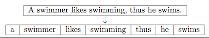

<div style="text-align: right"><span style="color:gray; font-size:0.5em">Tokenization example</span></div>

> Tokenization is the process of demarcating and possibly classifying sections of a string of input characters.

<div style="text-align: right"><span style="color:gray; font-size:0.5em">[Tokenization](https://en.wikipedia.org/wiki/Lexical_analysis#Tokenization) Wikipedia page</span></div>

@fa[arrow-down]

+++

**Different ways of tokenizing**

```python
'lorem ipsum dolor sit amet'.split()
# ['lorem', 'ipsum', 'dolor', 'sit', 'amet']

['2way'] != ['2', 'way']

['state-of-the-art'] != ['state', 'of', 'the', 'art']
```
@[1-2](Split sentences by spaces)
@[4](Account for words with numbers!)
@[6](Hyphens in words)

@fa[arrow-down]

+++

**How to choose best tokenization process:**

<br>

<table>
  <tr>
    <td>Manual process</td>
    <td>Data driven</td>
  </tr>
  <tr class="fragment">
    <td>Task-specific</td>
    <td>Language-specific</td>
  </tr>
</table>

---

### Text modeling

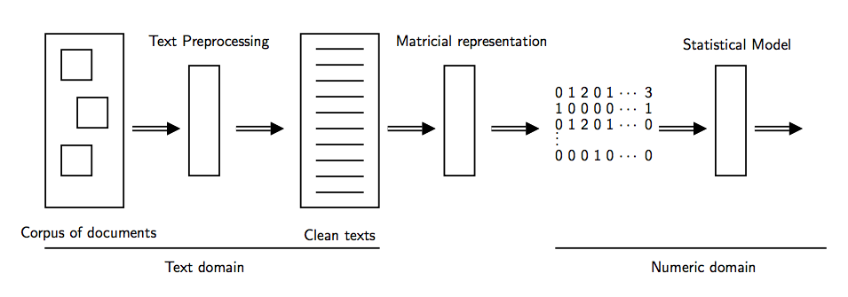

---

**Bag of Words (BoW)**

<br>

Intends to obtain a Vector Space representation of a document, originally in text domain.

@fa[arrow-down]

+++

- Madrid looks sunnier than usual this spring (1)
- Real Madrid plays against Atlético Madrid tonight (2)

<br>

<table style="color:gray; font-size:0.8em">
  <tr>
    <td rowspan="2">Docs</td>
    <td colspan="6">Terms</td>
  </tr>
  <tr>
    <td>Madrid</td>
    <td>looks</td>
    <td>plays</td>
    <td>sunnier</td>
    <td>tonight</td>
    <td>spring</td>
  </tr>
  <tr class="fragment">
    <td>(1)</td>
    <td>1</td>
    <td>1</td>
    <td>0</td>
    <td>1</td>
    <td>0</td>
    <td>1</td>
  </tr>
  <tr class="fragment">
    <td>(2)</td>
    <td>2</td>
    <td>0</td>
    <td>1</td>
    <td>0</td>
    <td>1</td>
    <td>0</td>
  </tr>
</table>


@fa[arrow-down]

+++

**N-gram representation**

> *n-gram* is a contiguous sequence of n items from a given sample of text or speech. The items can be phonemes,
syllables, letters, words or base pairs according to the application.

<div style="text-align: right"><span style="color:gray; font-size:0.5em">[n-gram](https://en.wikipedia.org/wiki/N-gram) Wikipedia page</span></div>

@fa[arrow-down]

+++

Real Madrid plays against Atlético Madrid tonight.

<br>

<table style="color:gray; font-size:0.8em">
  <tr>
    <th>Unigram (size 1)</th>
    <th>Bigram (size 2)</th>
  </tr>
  <tr class="fragment">
    <td>Madrid</td>
    <td>Real Madrid</td>
  </tr>
  <tr class="fragment">
    <td>Madrid</td>
    <td>Atlético Madrid</td>
  </tr>
  <tr class="fragment">
    <td>plays</td>
    <td>plays against</td>
  </tr>
</table>

---

**TF-IDF: TF**
<br>
<div style="text-align: left"><span style="color:gray; font-size:0.6em">Term Frequency</span></div>

> Different measures of raw frequency.

<br>

`\begin{eqnarray}
tf(t,d) & = & f(t,d) \nonumber\\
tf(t,d) & = & 1+log(f(t,d)) ~,~ (log(0) := 0) \nonumber\\
tf(t,d) & = & f(t,d) / (\max \lbrace f(w,d) : w \in D \rbrace) \nonumber
\end{eqnarray}`

@fa[arrow-down]

+++

**TF-IDF: IDF**
<br>
<div style="text-align: left"><span style="color:gray; font-size:0.6em">Inverse Document Frequency</span></div>

> Commonality of the term in the whole collection of documents.

<br>

`\begin{equation*}
idf(t,D) = \log \dfrac{|D|}{|\lbrace d \in D : t \in d \rbrace|}
\end{equation*}`

---

**Word embeddings**


<span style="color:gray; font-size:0.5em">Visualization of 3M words from GoogleNews dataset as embedded by  [UMAP](https://arxiv.org/pdf/1802.03426.pdf)</span>

@fa[arrow-down]

+++

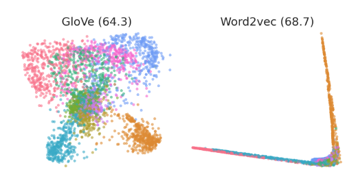

<div style="text-align: right"><span style="color:gray; font-size:0.5em">Representation of different word embeddings for MNIST ([Hashimoto et al., 2015](https://arxiv.org/pdf/1509.05808.pdf))</span></div>

<span style="font-size:0.6em; color:gray">[GloVe](https://nlp.stanford.edu/projects/glove/)</span> |
<span style="font-size:0.6em; color:gray">[Word2Vec / Doc2Vec](https://arxiv.org/pdf/1301.3781.pdf?)</span>

---

### Extract insights

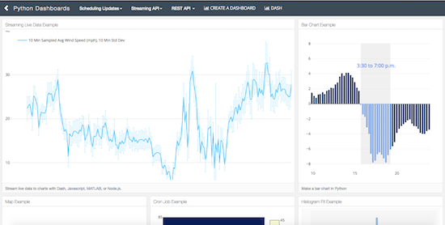

<div style="text-align: right"><span style="color:gray; font-size:0.5em">[Dashboard](https://plot.ly/python/dashboard/) example in [Plotly](https://plot.ly)</span></div>

---

**Sentiment analysis**

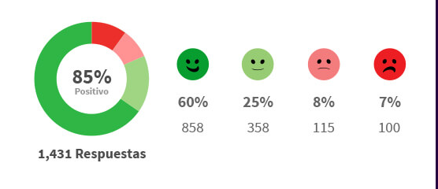

<div style="text-align: right"><span style="color:gray; font-size:0.5em">Sample dashboard from satisfaction terminals company. [Link](https://www.happy-or-not.com/es/smiley-terminal-2/)</span></div>


@fa[arrow-down]

+++

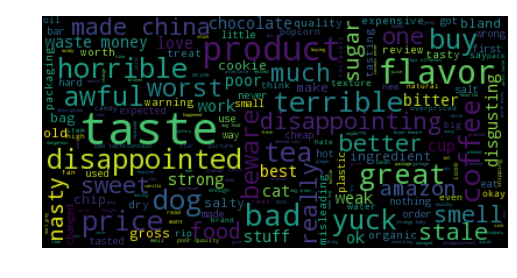

<div style="text-align: right"><span style="color:gray; font-size:0.5em">Wordcloud for negative sentiment reviews made by [budhiraja](https://www.kaggle.com/budhiraja/initial-analysis-and-word-clouds) in [Kaggle](https://www.kaggle.com)</span></div>

<span style="font-size:0.5em; color:gray">Count pos/neg words</span> |
<span style="font-size:0.5em; color:gray">Classify docs</span> |
<span style="font-size:0.5em; color:gray">Document similarity</span>

---

**Clustering**


<span style="color:gray; font-size:0.5em">Visualization of 3M words from GoogleNews dataset as embedded by  [UMAP](https://arxiv.org/pdf/1802.03426.pdf)</span>

@fa[arrow-down]

+++

**Clustering algorithms: K-means**

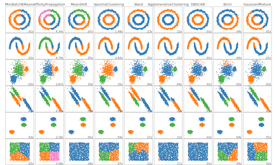

<div style="text-align: right"><span style="color:gray; font-size:0.5em">[Comparing different clustering algorithms on toy datasets](http://scikit-learn.org/stable/auto_examples/cluster/plot_cluster_comparison.html)</span></div>


@fa[arrow-down]

+++

**Clustering algorithms: LSI/LSA**

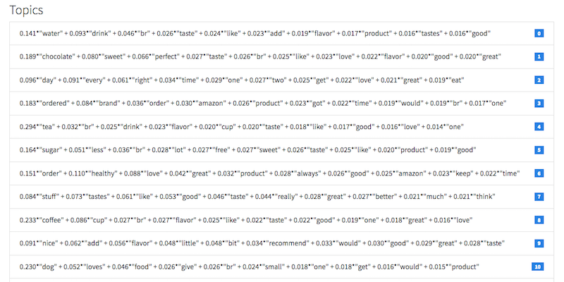

<div style="text-align: right"><span style="color:gray; font-size:0.5em">Sample topics extracted from Amazon Fine Food Reviews dataset.</span></div>

---

**Supervised problems**


<div style="text-align: right"><span style="color:gray; font-size:0.5em">[Towards Data Science](https://towardsdatascience.com/machine-learning-nlp-text-classification-using-scikit-learn-python-and-nltk-c52b92a7c73a) article on Text classification with scikit-learn and NLTK</span></div>

@fa[arrow-down]

+++

**Supervised algorithms: K-Nearest Neighbors**


<div style="text-align: right"><span style="color:gray; font-size:0.5em">5-NN applied over a given dataset ([Wikipedia](https://en.wikipedia.org/wiki/K-nearest_neighbors_algorithm))</span></div>

@fa[arrow-down]

+++

**Supervised algorithms: linear/logistic regression**


<div style="text-align: right"><span style="color:gray; font-size:0.5em">Logistic function, base equation for [logistic regression](https://en.wikipedia.org/wiki/Logistic_regression)</span></div>

@fa[arrow-down]

+++

`\begin{eqnarray}
y & = & w_{1} w_{1} + w_{2} x_{2} + \cdots + w_{N} x_{N} + b \nonumber\\
ln \left ( \dfrac{p_{i}}{1-p_{i}}\right) & = & w_{1} w_{1} + w_{2} x_{2} + \cdots + w_{N} x_{N} + b \nonumber
\end{eqnarray}`

@fa[arrow-down]

+++

**Supervised algorithms: Neural Networks**


<div style="text-align: right"><span style="color:gray; font-size:0.5em">The base of every neural network is the [perceptron](https://en.wikipedia.org/wiki/Perceptron)</span></div>

@fa[arrow-down]

+++

**Supervised algorithms: Support Vector Machines**


<div style="text-align: right"><span style="color:gray; font-size:0.5em">Spatial transformation provided by kernels in  [SVMs](https://en.wikipedia.org/wiki/Support_vector_machine)</span></div>

---

**Generative modeling**


@fa[arrow-down]

+++

<span style="color:gray; font-size:0.5em"><b>Deep Dream</b> example by [deepdreamgenerator](https://deepdreamgenerator.com)</span>


@fa[arrow-down]

+++

**Generative models**


<div style="text-align: right"><span style="color:gray; font-size:0.5em"><b>Recurrent Net</b> by [Elman](https://deeplearning4j.org/lstm.html)</span></div>

<span style="font-size:0.5em; color:gray">[LSTM](https://deeplearning4j.org/lstm.html)</span> |
<span style="font-size:0.5em; color:gray">[GANs](https://deeplearning4j.org/generative-adversarial-network)</span>

---

### Software modules

<br>


---

**tm (R)**

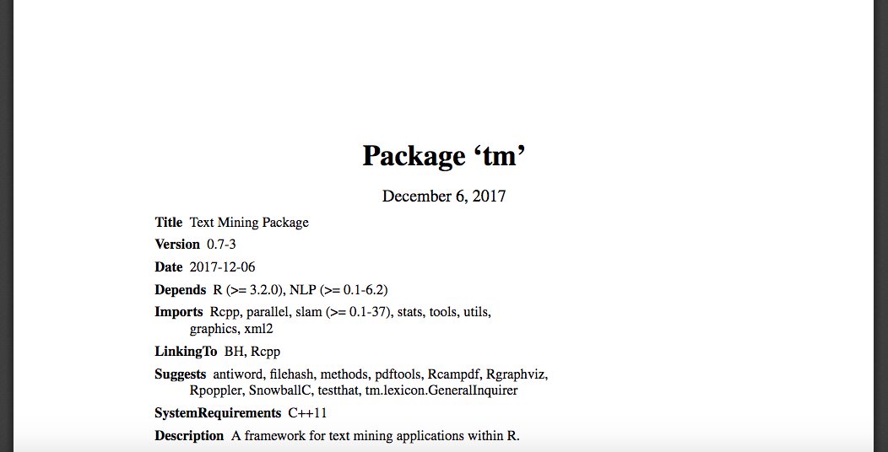

<div style="text-align: right"><span style="color:gray; font-size:0.5em">[tm](https://cran.r-project.org/web/packages/tm/tm.pdf) documentation first page.</span></div>

@fa[arrow-down]

+++

**tm features**

<br>

<table style="color:gray; font-size:0.8em">
  <tr>
    <th>Pros</th>
    <th>Cons</th>
  </tr>
  <tr class="fragment">
    <td>Classic solution</td>
    <td>Low-level package</td>
  </tr>
  <tr class="fragment">
    <td>Stable</td>
    <td></td>
  </tr>
  <tr class="fragment">
    <td>Extensible with plugins</td>
    <td></td>
  </tr>
</table>

@fa[arrow-down]

+++

**tidytext (R)**

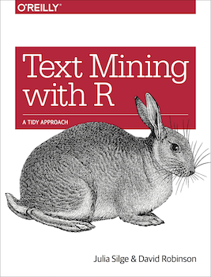

<div style="text-align: right"><span style="color:gray; font-size:0.5em">[tidytext](https://www.tidytextmining.com/) book cover</span></div>

@fa[arrow-down]

+++

**tidytext features**

<br>

<table style="color:gray; font-size:0.8em">
  <tr>
    <th>Pros</th>
    <th>Cons</th>
  </tr>
  <tr class="fragment">
    <td>Great documentation and textbook</td>
    <td>Small support community</td>
  </tr>
  <tr class="fragment">
    <td>High-level algorithms</td>
    <td></td>
  </tr>
  <tr class="fragment">
    <td>Pipelines supported</td>
    <td></td>
  </tr>
</table>

---

**NLTK (Python)**

<br>


<div style="text-align: right"><span style="color:gray; font-size:0.5em">[NLTK](https://www.nltk.org/) example on sentence parsing.</span></div>

@fa[arrow-down]

+++

**NLTK features**

<br>

<table style="color:gray; font-size:0.8em">
  <tr>
    <th>Pros</th>
    <th>Cons</th>
  </tr>
  <tr class="fragment">
    <td>Myriad of resources</td>
    <td>Lacks newest algorithms</td>
  </tr>
  <tr class="fragment">
    <td>Complete classic NLP</td>
    <td></td>
  </tr>
  <tr class="fragment">
    <td>Standard solution for NLP</td>
    <td></td>
  </tr>
  <tr class="fragment">
    <td>Huge community</td>
    <td></td>
  </tr>
</table>

@fa[arrow-down]

+++

**gensim (Python)**

<br>


<div style="text-align: right"><span style="color:gray; font-size:0.5em">[Gensim](https://radimrehurek.com/gensim/) logo</span></div>

@fa[arrow-down]

+++

**gensim features**

<br>

<table style="color:gray; font-size:0.8em">
  <tr>
    <th>Pros</th>
    <th>Cons</th>
  </tr>
  <tr class="fragment">
    <td>High-level algorithms</td>
    <td>Learning curve</td>
  </tr>
  <tr class="fragment">
    <td>Some cutting-edge advances</td>
    <td>Difficult to grasp details</td>
  </tr>
  <tr class="fragment">
    <td>In-disk capabilities</td>
    <td></td>
  </tr>
  <tr class="fragment">
    <td>Great documentation and examples</td>
    <td></td>
  </tr>
  <tr class="fragment">
    <td>Distributed computing</td>
    <td></td>
  </tr>
</table>

---

**Commercial software**

Just a small selection of them are:

<br>

<table style="color:gray; font-size:0.8em">
  <tr class="fragment">
    <td>IBM Watson</td>
    <td>Google Cloud Translation</td>
    <td>NVivo</td>
    <td>IBM SPSS Text Analytics</td>
  </tr>
  <tr class="fragment">
    <td>SAS High Performance Text Mining</td>
    <td>Microsoft Language Understanding Intelligent Service</td>
    <td>OdinText</td>
    <td>Amazon Comprehend</td>
  </tr>
</table>


---

### Next steps

<span style="font-size:1em; color:gray">Where are we now?</span> |
<span style="font-size:1em; color:gray">What else is yet to come?</span>

<br>

@fa[arrow-down]

+++

<table style="color:gray; font-size:0.8em">
  <tr>
    <th>Problems</th>
    <th>Current solution</th>
    <th>Near future</th>
  </tr>
  <tr class="fragment">
    <td>Spam classification</td>
    <td>Supervised algorithms (~99%)</td>
    <td>--</td>
  </tr>
  <tr class="fragment">
    <td>Chatbots</td>
    <td>Generative models</td>
    <td>Improved generative models</td>
  </tr>
  <tr class="fragment">
    <td>Text summarizer</td>
    <td>Document embeddings</td>
    <td>Local/global embeddings</td>
  </tr>
  <tr class="fragment">
    <td>Documents semantics</td>
    <td>Document embeddings</td>
    <td>Semantic modelling</td>
  </tr>
</table>

<br>

---

**Online learning**

<span style="font-size:0.8em">At any given time, `t`, which is the best candidate to maximize accuracy for the model? `t+1`? `t+2`?...</span>


---

**Active learning**

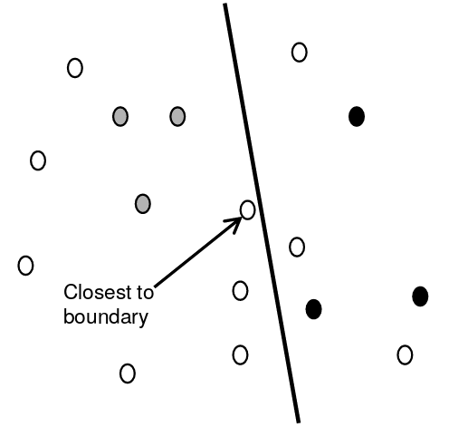

<div style="text-align: right"><span style="color:gray; font-size:0.5em">Bryan Pardo, EECS 395/495 Modern Methods in Machine Learning, Spring 2010</span></div>

---

### Online resources


<table style="color:gray; font-size:0.8em">
  <tr>
    <td>[RDataMining](http://www.rdatamining.com/docs)</td>
  </tr>
  <tr>
    <td>[Datacamp](https://www.datacamp.com/community/blog/text-mining-in-r-and-python-tips) tips for Text Mining projects in R/Python</td>
  </tr>
  <tr>
    <td>[gensim](http://radimrehurek.com/gensim/wiki.html) documentation page (with tutorials).</td>
  </tr>
  <tr>
    <td>[tidytext](http://tidytextmining.com/) R package textbook.</td>
  </tr>
  <tr>
    <td>[NLTK](http://www.nltk.org/book/) free textbook for NLP with Python.</td>
  </tr>
  <tr>
    <td>[Information Retrieval](https://nlp.stanford.edu/IR-book/) textbook (Free)</td>
  </tr>
  <tr>
    <td>[Foundations of Statistical Natural Language Processing](https://nlp.stanford.edu/fsnlp/promo/) textbook (Not free)</td>
  </tr>
</table>

---

**Any questions?**

<br>


