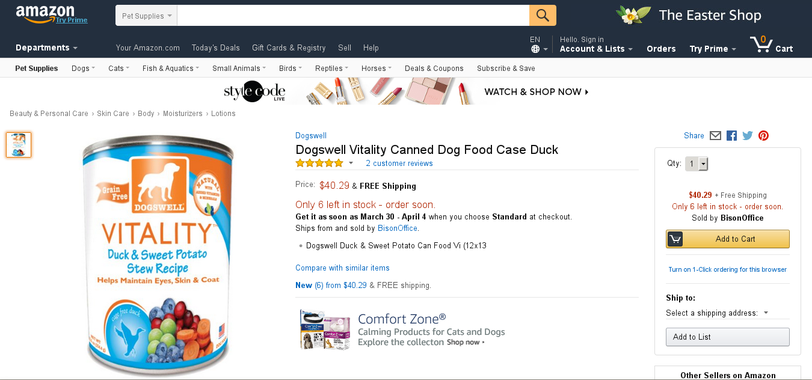
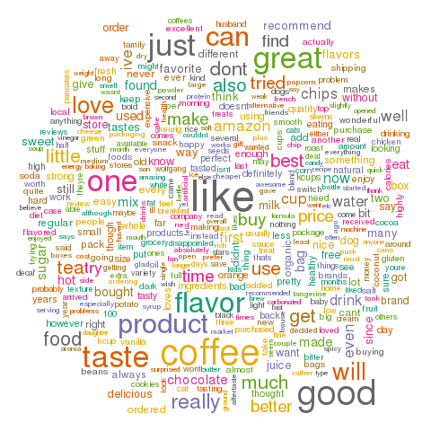

@title[Main slide]

## Natural Language Processing - practical case
<span style="font-size:0.6em; color:gray">Máster Big Data Science (UVa)</span> |
<span style="font-size:0.6em; color:gray">Fernando Rabanal Presa</span>

---
#### Disclaimer

<br><hr>
All materials provided here reflect my own views and not those of my employer.
<hr>
Please, do not take my opinions too seriously as I tend to be wrong more times than expected (on average) every single day.

---

[https://gitpitch.com/frabanalpresa/mbds/practical_case](https://gitpitch.com/frabanalpresa/mbds/practical_case)

---

### Practical case: Amazon Fine Food reviews




@fa[arrow-down]

+++

**License**

- CC0: Public Domain License
- [J. McAuley and Jure Leskovec, From amateurs to connoisseurs: modeling the evolution of user expertise through online reviews, 2013](http://i.stanford.edu/~julian/pdfs/www13.pdf)

<br>

[http://snap.stanford.edu/data/web-FineFoods.html](http://snap.stanford.edu/data/web-FineFoods.html)
[https://www.kaggle.com/snap/amazon-fine-food-reviews](https://www.kaggle.com/snap/amazon-fine-food-reviews)

<span style="color:gray; font-size:0.6em">Kernels</span> | <span style="color:gray; font-size:0.6em">Discussions</span> | <span style="color:gray; font-size:0.6em">Visualizations</span>

---

### Dataset information

<table style="color:gray; font-size:0.8em">
  <tr>
    <td>Number of reviews</td>
    <td>568454</td>
  </tr>
  <tr class="fragment">
    <td>Number of users</td>
    <td>256059</td>
  </tr>
  <tr class="fragment">
    <td>Number of products</td>
    <td>74258</td>
  </tr>
  <tr class="fragment">
    <td>Users with >50 reviews</td>
    <td>260</td>
  </tr>
  <tr class="fragment">
    <td>Median words per review</td>
    <td>56</td>
  </tr>
  <tr class="fragment">
    <td>Timespan</td>
    <td>Oct 99 - Oct 12</td>
  </tr>
</table>

@fa[arrow-down]

+++

**Other information**

> From amateurs to connoisseurs: modeling the evolution of user expertise through online reviews

<div style="text-align: right"><span style="color:gray; font-size:0.5em">[J. McAuley and Jure Leskovec, 2013](http://i.stanford.edu/~julian/pdfs/www13.pdf)</span></div>

Different problems can be solved:

- Sentiment analysis
- Regression over ratings
- Generate synthetic reviews
- Categorize users
- Clusterize products
- Acquire knowledge about a domain

---

### Proposal

<table style="color:gray; font-size:0.8em">
  <tr>
    <td>Have some knowledge about real-world NLP problems.</td>
  </tr>
  <tr class="fragment">
    <td>Solve a NLP question with real data.</td>
  </tr>
  <tr class="fragment">
    <td>Apply a NLP algorithm in R/Python to solve a problem.</td>
  </tr>
  <tr class="fragment">
    <td>Have fun!</td>
  </tr>
</table>

---

### Introduction

- Retain only 'Text' field in each sample.
- Explore some of the reviews in the dataset visually (5-10)

@fa[arrow-down]

+++

```python
# Reveived my item fast! It was exactly what I ordered
# in excellent shape with safe shipping - i will came
# back and shop here again.  Thanks

# I tasted this Matcha from Rishi the first time today.
# The flavor is bright, assertive and fresh...

# When I was young, nearly a half century ago, Chuckles
# was a very popular candy. I really enjoyed eating
# these jellied treats...
```

@fa[arrow-down]

+++

**For starters...**

Display some statistics about the text, once it has been cleaned:

<table style="color:gray; font-size:0.8em">
  <tr><th colspan="4">Top Count Words Used In Review</th></tr>
  <tr>
    <td>br</td>
    <td>22349</td>
    <td>good</td>
    <td>7301</td>
  </tr>
  <tr class="fragment">
    <td>like</td>
    <td>10099</td>
    <td>product</td>
    <td>6976</td>
  </tr>
  <tr class="fragment">
    <td>tast</td>
    <td>9321</td>
    <td>one</td>
    <td>6511</td>
  </tr>
  <tr class="fragment">
    <td>flavor</td>
    <td>7819</td>
    <td>love</td>
    <td>6311</td>
  </tr>
  <tr class="fragment">
    <td>coffe</td>
    <td>7376</td>
    <td>tri</td>
    <td>6052</td>
  </tr>
</table>

<span style="color:gray; font-size:0.6em">Kaggle, 2017</span>

---

### Choose a problem

<table style="color:gray; font-size:0.8em">
  <tr><th colspan="2">Classic NLP problems</th></tr>
  <tr>
    <td>Clustering</td>
    <td>k-means, hierarchical...</td>
  </tr>
  <tr class="fragment">
    <td>Topic modeling</td>
    <td>LSI/LDA</td>
  </tr>
  <tr class="fragment"><th colspan="2">Other problems</th></tr>
  <tr class="fragment">
    <td>Word similarity</td>
    <td>GLoVe, word2vec</td>
  </tr>
  <tr class="fragment">
    <td>Generate reviews</td>
    <td>LSTM, GAN</td>
  </tr>
  <tr class="fragment">
    <td colspan="2">Summarize reviews</td>
  </tr>
  <tr class="fragment">
    <td colspan="2">Clusterize users</td>
  </tr>
  <tr class="fragment">
    <td colspan="2">Rating prediction</td>
  </tr>
  <tr class="fragment">
    <td colspan="2">Popularity prediction</td>
  </tr>
</table>

---

### Choose an environment


<div style="text-align: right"><span style="color:gray; font-size:0.5em">[DataCamp](https://www.datacamp.com/community/tutorials/r-or-python-for-data-analysis) analysis for R vs Python.</span></div>

@fa[arrow-down]

+++

**R**

<table style="color:gray; font-size:0.8em">
  <tr>
    <th>Formats</th>
    <th>Packages</th>
  </tr>
  <tr class="fragment">
    <td>R scripts</td>
    <td>tm</td>
  </tr>
  <tr class="fragment">
    <td>RMarkdown</td>
    <td>tidytext</td>
  </tr>
  <tr class="fragment">
    <td>R Notebook</td>
    <td></td>
  </tr>
</table>


@fa[arrow-down]

+++

**Python**

<table style="color:gray; font-size:0.8em">
  <tr>
    <th>Formats</th>
    <th>Packages</th>
  </tr>
  <tr class="fragment">
    <td>Scripts</td>
    <td>NLTK, gensim</td>
  </tr>
  <tr class="fragment">
    <td>Jupyter Notebook</td>
    <td>sklearn</td>
  </tr>
  <tr class="fragment">
    <td>Library</td>
    <td>pandas</td>
  </tr>
</table>

---

## Have fun!



<div style="text-align: right"><span style="color:gray; font-size:0.5em">[Kaggle home page](https://www.kaggle.com/snap/amazon-fine-food-reviews) for dataset, SNAP group, 2016.</span></div>
