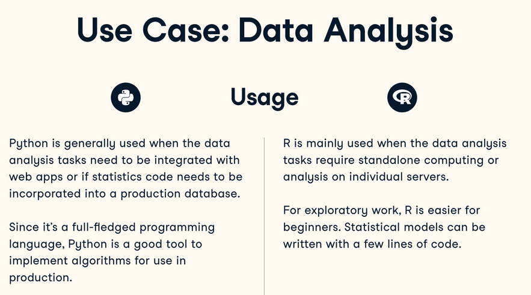

# Natural Language Processing - Practical Case

## Fernando Rabanal Presa

**Máster Big Data Science (Universidad de Valladolid)**

---
<!-- paginate: true -->
<!-- footer: 'NLP - Máster Big Data Science (UVA)' -->

## Disclaimer

* All materials provided here reflect my own views and not those of my employer.


* Please, do not take my opinions too seriously as I tend to be wrong more times than expected (on average) every single day.

---

### [https://github.com/frabanalpresa/mbds/master](https://github.com/frabanalpresa/mbds/master)

---

## Practical case: Amazon Fine Food reviews
<br>


Image from D. Chen [analysis](https://www.thisisdchen71.com/project/amazon-fine-foods-reviews-analysis/)

---

### License
<br>

- CC0: Public Domain License
- [J. McAuley and Jure Leskovec, From amateurs to connoisseurs: modeling the evolution of user expertise through online reviews, 2013](http://i.stanford.edu/~julian/pdfs/www13.pdf)


---

### Data sources
<br>

[http://snap.stanford.edu/data/web-FineFoods.html](http://snap.stanford.edu/data/web-FineFoods.html)
[https://www.kaggle.com/snap/amazon-fine-food-reviews](https://www.kaggle.com/snap/amazon-fine-food-reviews)

* Kernels

* Discussions

* Visualizations

---

## Dataset information
<br>

| | |
|:-|:-|
| Number of reviews | 568,454 |
| Number of users | 256,059 |
| Number of products | 74,258 |
| Users with >50 reviews | 260 |
| Median words per review | 56 |
| Timespan | Oct '99 - Oct '12 |
---

### Other information
<br>

> From amateurs to connoisseurs: modeling the evolution of user expertise through online reviews

[J. McAuley and Jure Leskovec, 2013](http://i.stanford.edu/~julian/pdfs/www13.pdf)

---

Different problems can be solved:

* Sentiment analysis

* Regression over ratings

* Generate synthetic reviews

* Categorize users

* Clusterize products

* Acquire knowledge about a domain

---

## Proposal

* Have some knowledge about real-world NLP problems.

* Solve a NLP question with real data.

* Apply a NLP algorithm in R/Python to solve a problem.

* Have fun!

---

## Introduction
<br>

* Retain only 'Text' field in each sample.

* Explore some of the reviews in the dataset visually (5-10)

---

### Example #1
<br>

```
# Reveived my item fast! It was exactly what I ordered
# in excellent shape with safe shipping - i will came
# back and shop here again.  Thanks
```

---

### Example #2
<br>

```
# I tasted this Matcha from Rishi the first time today.
# The flavor is bright, assertive and fresh...
```

---

### Example #3
<br>

```
# When I was young, nearly a half century ago, Chuckles
# was a very popular candy. I really enjoyed eating
# these jellied treats...
```

---

### Text preprocessing
<br>

```
text = ''
text = text.lower()
```

<br>

* Load sentence/text/document
* Lowercase characters

---

```
import string

text = \
  text.translate(str.maketrans('','',
                               string.punctuation))
```

<br>

* Remove punctuation

---

```
from nltk.corpus import stopwords

text = [word for word in text.split()
        if word not in stopwords.words('english')]
text = ' '.join(text)
```

<br>

* Remove stopwords
* Form a full sentence

---

### Example #1
<br>

```
# Reveived my item fast! It was exactly what I ordered
# in excellent shape with safe shipping - i will came
# back and shop here again.  Thanks
```
<br>

```
# reveived item fast exactly ordered
# excellent shape safe shipping came back shop thanks
```

---

### Example #2
<br>

```
# I tasted this Matcha from Rishi the first time today.
# The flavor is bright, assertive and fresh...
```
<br>

```
# tasted matcha rishi first time today flavor
# bright assertive fresh
```

---

### Example #3
<br>

```
# When I was young, nearly a half century ago, Chuckles
# was a very popular candy. I really enjoyed eating
# these jellied treats...
```
<br>

```
# young nearly half century ago chuckles popular
# candy really enjoyed eating jellied treats
```

---

### For starters...
<br>

Display some statistics about the text, once it has been cleaned:
<br>

**Top Count Words Used In Review**

| | | | | | | | |
|:-|:-|:-|:-|:-|:-|:-|:-|
| br | 22349 | flavor | 7819 | product | 6976 | tri | 6052 |
| like | 10099 | coffe  | 7376 | one | 6511 | | |
| tast | 9321 | good | 7301 | love | 6311 | | |

Kaggle, 2017

---

## Choose a problem
<br>

Classic NLP problems:

* Clustering: k-means, hierarchical...

* Topic modeling: LSI, LDA...

---

Other problems that could be solved:

* Word similarity: GLoVe, word2vec...

* Generate reviews: LSTM, GAN

* Summarize reviews

* Clusterize users

* Rating prediction

* Popularity prediction

* ...

---

### Choose an environment



[DataCamp](https://www.datacamp.com/community/tutorials/r-or-python-for-data-analysis) analysis for R vs Python.

---

### R
<br>

| Formats | Packages |
|:-|:-|
| R scripts | tm |
| RMarkdown | tidytext |
| R Notebook | |

---

### Python
<br>

| Formats | Packages |
|:-|:-|
| Scripts | NLTK, gensim |
| Jupyter Notebook | scikit-learn |
| Python module | pandas |

---

## Have fun!


[Kaggle home page](https://www.kaggle.com/snap/amazon-fine-food-reviews) for dataset, SNAP group, 2016.

---


An interesting analysis by [Daniel Chen](https://www.thisisdchen71.com/project/amazon-fine-foods-reviews-analysis/)

---

## Additional challenges
<br>

- [Yelp Dataset](https://www.yelp.com/dataset/challenge), also in [Kaggle Datasets](https://www.kaggle.com/yelp-dataset/yelp-dataset).

- [Open Food Facts](https://world.openfoodfacts.org/), also in [Kaggle Datasets](https://www.kaggle.com/openfoodfacts/world-food-facts).
